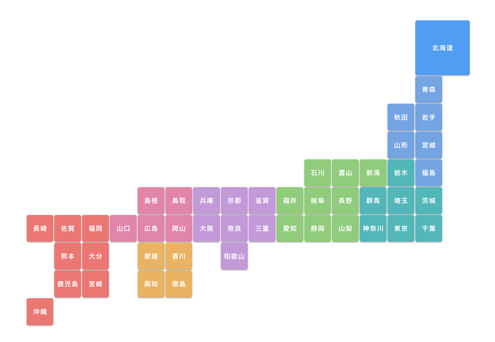

# japan-prefecture

このVueコンポーネントは日本の各県を表現した地方別の地図を生成します。各県はボタンとして表現され、そのボタンをクリックすることで対応する県名がemitされます。ボタンの位置と色は、県の地方と実際のおおまかな位置を反映しています。

## コンポーネントの構成

このコンポーネントは3つの部分から構成されています: `template`、`script`、そして`style`です。

### `template`

`template`部分は、地図上の各県を表現するボタンをレンダリングします。各ボタンは`v-btn`要素であり、それぞれが対応する県を示すように配置されています。ボタンがクリックされると、対応する県名が`handleClick`関数を介してemitされます。

### `script`

`script`部分は以下の要素を定義します。

- `handleClick`: ボタンがクリックされたときに実行され、対応する県名をemitする関数です。
- `prefectures`: 全国の各県名の配列です。
- `prefectureMap`: ボタンの位置と対応する県名のインデックスをマッピングするMapオブジェクトです。
- `getPrefectureName`: 特定のボタンの位置から対応する県名を取得する関数です。
- `getRegionClass`: 特定のボタンの位置から対応する地方のクラス名を取得する関数です。
- `shouldDisplayButton`: ボタンを表示するかどうかを決定する関数です。

### `style`

`style`部分では、ボタンのサイズ、位置、色などを定義しています。各ボタンの色は、それぞれの地方に対応したクラスによって制御されています。

## 注意事項

地図上の位置と実際の位置が完全に一致するわけではありません。

このコンポーネントは簡易的なものであり、特定のプロジェクトに合わせてカスタマイズすることを前提としています。そのため、対応する県名や地図上の位置、ボタンのスタイルなどは必要に応じて変更してください。

また、このコンポーネントを使用する際の責任は全てユーザー自身にあります。開発者は、このコンポーネントの使用によって発生するいかなる問題についても責任を負いません。

